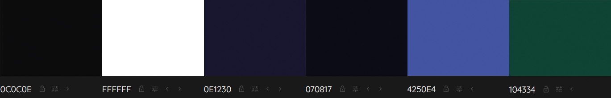

# Joystick Junction

A bold new venture in the world of gaming forums, designed to empower gamers with a platform for unfiltered discussions and reviews. This message board is dedicated to fostering a community where gamers can freely express their opinions and insights on video games, without the worry of censorship from developers or publishers.

Leveraging the comprehensive API from IGDB, Joystick Junction offers a wealth of up-to-date information on a vast array of video games. This includes the latest releases, undiscovered gems, and timeless classics, ensuring that our community stays informed and engaged.

While we encourage open and honest dialogue, Joystick Junction is committed to maintaining a respectful and inclusive environment. Our moderation team diligently works to uphold these standards, ensuring discussions remain constructive and welcoming for all members.

Unique to Joystick Junction is the opportunity for game developers to directly engage with their audience. This interactive space allows creators to gather feedback, participate in discussions, and connect with their player base in a meaningful way. It's a place where the voices of both gamers and creators can coexist and collaborate, contributing to the enrichment of the gaming experience.

Join Joystick Junction to be part of a dynamic community where your voice matters, where discussions shape the future of games, and where developers and gamers come together to share their passion for the virtual world.

<h2>User Experience Design (UXD)</h2>

<h3>Strategy</h3>

<h4>Theme 1: Community Engagement and Discussions</h4>

##### Epic: Forum Functionality

###### USER STORY - Easy Site Navigation (First-Time Visitor): As a first-time visitor, I want to easily understand how to navigate and use the forum, so I can quickly get involved in discussions

###### USER STORY - Discover New Content (Frequent Visitor): As a frequent visitor, I want to see new or updated threads since my last visit, so I can stay engaged with current discussions

###### USER STORY - Resume Discussions (Returning Visitor): As a returning visitor, I want to be able to easily find and resume previous discussions I was involved in, so that I can keep engaged

<h4>Theme 2: Gaming Information and Resources</h4>

##### Epic: Integration with IGDB API

###### USER STORY - Access Game Information: As a gamer, I want to access up-to-date information on games so that I can stay informed about new and existing titles

###### USER STORY - View Game Reviews and Ratings: As a gamer, I want to see game reviews and ratings so that I can make informed decisions about what games to play

<h4>Theme 3: Developer Interaction</h4>

##### Epic: Developer Engagement Tools

###### USER STORY - Developer Profile Creation: As a game developer, I want to create a profile so that I can interact with the gaming community

###### USER STORY - Participate in Community Discussions: As a developer, I want to participate in discussions so that I can receive feedback and engage with my audience

###### USER STORY - Showcase New Games: As a developer, I want to showcase my new games so that I can attract potential players and receive early feedback

###### USER STORY - Developer Updates (Returning Visitor): As a returning visitor, I want notifications or a news feed feature that updates me on interactions or responses from game developers in threads I'm interested in

<h4>Theme 4: User Experience and Accessibility</h4>

##### Epic: Platform Usability

###### USER STORY - Intuitive Interface: As a user, I want a user-friendly interface so that I can easily navigate the forum

###### USER STORY - Accessibility Features: As a user with disabilities, I want accessibility features so that I can comfortably use the platform

<h4>Theme 5: Account Management</h4>

##### Epic: User Profile Management

###### USER STORY - Update Personal Information: As a user, I want to update my personal information so that my profile reflects my current details

###### USER STORY - Add or Change Profile Image: As a user, I want to add or change my profile image so that my profile is more personalised

###### USER STORY - Customise Notifications: As a user, I want to customise my notification settings so that I can control what alerts I receive

###### USER STORY - Personalise Forum Appearance: As a user, I want to choose themes or visual settings for the forum so that I can have a more personalised browsing experience

##### Epic: Sign-In and Authentication

###### USER STORY - Streamlined Registration (First-Time Visitor): As a first-time visitor, I want a streamlined registration process, so I can quickly join the community

###### USER STORY - Sign-In with Username/Password: As a user, I want to sign in with a username and password so that I can access my account

###### USER STORY - Social Network Sign-In: As a user, I want the option to sign in using social networks (like Facebook, Google, or Twitter) for ease of access and to link my social media profiles

##### Epic: Community Features

###### USER STORY - Follow Users and Developers: As a user, I want to follow other users or developers so that I can keep track of their posts and interactions

###### USER STORY - Create and Join Interest Groups: As a user, I want to create and join groups based on specific gaming interests or topics so that I can engage in more focused discussions

##### Epic: Security and Privacy

###### USER STORY - Control Profile Visibility: As a user, I want to control who can see my profile and posts so that I can manage my privacy on the forum

###### USER STORY - Secure Authentication Methods: As a user, I want to have secure authentication methods (like two-factor authentication) to ensure the safety of my account

<h4>Theme 6: Site Administration and Moderation</h4>

##### Epic: Content Moderation

###### USER STORY - Monitor Compliance: As an admin, I want to monitor posts and threads to ensure they comply with community guidelines

###### USER STORY - Edit or Delete Violating Posts: As an admin, I want the ability to delete or edit posts that violate rules to maintain a respectful environment

###### USER STORY - Handle Reported Content: As an admin, I want to receive notifications of reported posts or threads so that I can review them promptly

##### Epic: User Management

###### USER STORY - Highlight Moderators (Frequent Visitor): As a frequent visitor, I want to see active moderators and community leaders highlighted, so I know whom to contact for help or information

###### USER STORY - Manage User Accounts: As an admin, I want to view and manage user accounts to ensure community standards are upheld

###### USER STORY - Address Community Violations: As an admin, I want to suspend or ban users who repeatedly violate community guidelines

###### USER STORY - Assign Roles and Permissions: As a site owner, I want to assign and manage different roles and permissions for admins and developers to help in community moderation and management

##### Epic: Analytics and Reporting

###### USER STORY - Access User Activity Analytics: As a site owner, I want to access analytics on user activity and engagement to understand community trends

###### USER STORY - Generate Engagement Reports: As a site owner, I want to generate reports on forum metrics such as active users, post frequency, and popular topics to guide decision-making

##### Epic: Site Management

###### USER STORY - Manage Categories and Subforums: As an admin, I want to manage and update categories and subforums to keep the forum organised and relevant

##### Epic: Feedback and Improvement

###### USER STORY - Collect User Feedback: As a site owner, I want to collect and review user feedback to identify areas for improvement

<h4>Strategy Tradeoffs</h4>

<h3>Scope</h3>

#### Sprint 1 Features ####

##### Must Have

- Assign Roles and Permissions
- Edit or Delete Violating Posts
- Monitor Compliance
- Sign-In with Username/Password
- Streamlined Registration (First-Time Visitor)
- Intuitive Interface
- Access Game Information
- Easy Site Navigation (First-Time Visitor)

##### Should have

- Manage User Accounts
- Manage Categories and Subforums
- Address Community Violations
- Accessibility Features
- Discover New Content (Frequent Visitor)

##### Could have

- Highlight Moderators (Frequent Visitor)
- Handle Reported Content
- Secure Authentication Methods
- Social Network Sign-In
- Participate in Community Discussions
- View Game Reviews and Ratings

#### Sprint 1 Requirement Types ####

- Languages: HTML, CSS, JavaScript Python
- Frameworks: Django
- Database: Psycopg, Elephant SQL

#### Future Sprint Features ####

- Collect User Feedback
- Generate Engagement Reports
- Access User Activity Analytics
- Control Profile Visibility
- Create and Join Interest Groups
- Follow Users and Developers
- Personalise Forum Appearance
- Customise Notifications
- Add or Change Profile Image
- Update Personal Information
- Developer Updates (Returning Visitor)
- Showcase New Games (Developer)
- Developer Profile Creation
- Resume Discussions (Returning Visitor)

#### Future Sprint Requirement Types ####
- Languages: HTML, CSS, JavaScript Python
- Frameworks: Django
- Database: Psycopg, Elephant SQL

<h3>Structure</h3>

Touchpoints - Responsive Website

<h3>Skeleton</h3>

<h3>Wireframe - Desktop Homepage - Sprint 1</h3>

<h3>Wireframe - Desktop Game Page - About - Sprint 1</h3>

<h3>Wireframe - Desktop Game Page - Main thread and subthreads - Sprint 1</h3>

The comment structure will be the same for the main thread and subthread.

<h3>Wireframe - Desktop Game Page - List of Subthreads - Sprint 1</h3>

<h3>Wireframe - Desktop Account Page - Register - Sprint 1</h3>

<h3>Wireframe - Desktop Account Page - Login - Sprint 1</h3>

<h3>Wireframe - Desktop Account Page - Regular User - Sprint 1</h3>

<h3>Wireframe - Desktop Account Page - Admin User - Sprint 1</h3>

<h3>Wireframe - Mobile Homepage - Sprint 1</h3>

<h3>Wireframe - Mobile Game Page - About - Sprint 1</h3>

<h3>Wireframe - Mobile Game Page - Main thread and subthreads - Sprint 1</h3>

<h3>Wireframe - Mobile Game Page - Main thread and subthreads - Sprint 1</h3>

    
<h3>Surface</h3>

<h4>Fonts</h4>

Headings - [Roboto Slab](https://fonts.google.com/specimen/Roboto+Slab?query=Roboto+Slab)
I've chosen Roboto Condensed for my heading font because it's a sans-serif that's both modern and clean, perfect for my headings. It really stands out and maintains excellent readability, which is crucial for my subheadings and menu items.

Body Text - [Open Sans](https://fonts.google.com/specimen/Open+Sans?query=Open+Sans)
For the body text, I'm pairing it with Open Sans, another sans-serif font that complements Roboto Condensed nicely. It's made for clear legibility across web and mobile interfaces. Its friendly and neutral design is just what I need for the lengthy forum posts and discussions on my site.

<h4>Colours</h4>

- **#0c0c0e (Very Dark Blue-Gray):** This color is nearly black but carries a hint of blue, making it a sophisticated and robust choice for the primary color. It's perfect for headers, footers, primary backgrounds, and important text, offering a subtle alternative to pure black.
- **#ffffff (Pure White):** A classic and clean white that serves as the ideal background color, especially for creating strong contrasts with darker colors. Versatile, suitable for primary text, as well as user interface elements such as cards, buttons, and input fields, ensuring maximum readability and a crisp, clean appearance.
- **#0E1230 (Dark Blue):** Slightly lighter than the primary color, this deep blue adds depth and layering to the design. Well-suited for secondary backgrounds, sidebars, or text that doesn't need to be as prominent as the content in the primary color.
- **#070817 (Even Darker Blue):** This color adds depth and richness to the design, enhancing the visual appeal of secondary backgrounds and making them visually distinct from the primary background.
- **#1c67fd (Bright Blue)**: This bright and lively blue is eye-catching and can be used as an accent color to draw attention to key elements like calls to action, links, or highlighted information. It's a vibrant choice that can add energy and dynamism to a design when used sparingly.
- **#104334 (Deep Teal Green):** A dark and rich teal, both elegant and versatile, serving as an accent or secondary color. Ideal for less dominant elements that still demand visual interest, such as secondary buttons, icons, or background panels.

<h4>Technologies Used</h4>

<h5>Languages, Frameworks, Databases</h5>

Languages
- HTML
- CSS
- Javascript
- Python

Frameworks
- Django
  - [DJ Databse](https://pypi.org/project/dj-database-url/)
  - [Django SummerNote](https://summernote.org/)

Databases
- Psycopg
- Elephant SQL

<h5>Websites, Software & other Tools</h5>

- [Codeanywhere](https://codeanywhere.com/solutions/collaborate) This is was my IDE for the project.
- [CodePen](codepen.io) I used this to test code outside of [Codeanywhere](https://codeanywhere.com/solutions/collaborate) so that I didn't use up hours unnecessarily. I also used it to find the right filter colour for my SVGs.
- [Git](https://git-scm.com/) Used to commit and push code to [Github](https://github.com/).
- [Github](https://github.com/) This was used as a remote repository and I also used Github pages to host the live site.
- [Conventional Commits](https://www.conventionalcommits.org/en/v1.0.0-beta.2/) Used to learn and stick to a conventional commit framework.
- [Midjourney](https://www.midjourney.com/) I used this AI tool for image generation.
- [Photoshop](https://www.adobe.com/uk/products/photoshop.html) Used for Creating, Editing and resizing
- [Illustrator](https://www.adobe.com/uk/products/illustrator.html) Used to create vectors from AI generated images and perosnally made images
- [AdobeXD](https://helpx.adobe.com/support/xd.html) Used to create wireframes.
- [Google Fonts](https://fonts.google.com/) Sourcing fonts.
- [Color Space](http://colormind.io/) Used to create colour palette.
- [Am I Responsive?](https://ui.dev/amiresponsive) Used to create mock-ups for various screen sizes.
- [Dynamic Drive](http://tools.dynamicdrive.com/favicon/) Used to create favicon.

